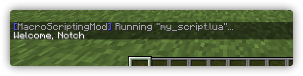

# Getting Started

Let's discover the **creation and execution of a script**.

:::info

It is advised to learn the basics of Lua before getting into scripting.  
Here are some helpful resources to get you started:

-   [Learn Lua in 15 Minutes](https://learnxinyminutes.com/docs/lua/)
-   [Programming in Lua](https://www.lua.org/pil/1.html)
-   [Learn Lua in one video](https://www.youtube.com/watch?v=iMacxZQMPXs)

:::

## Creating a script

To write a script, you must create a file with the extension `.lua` in the `scripts` directory inside your `.minecraft` directory.

Now, open that file and write the following lines into that file:

```lua title="my_script.lua"
require("player")

print("Welcome, " .. player.get_info().name)
```

This will print `"Welcome, <Your ingame name>"` to the chat when executing the script.

## Executing the script

To execute our newly written script, we can simply send `.run my_script.lua` in the in-game chat.


